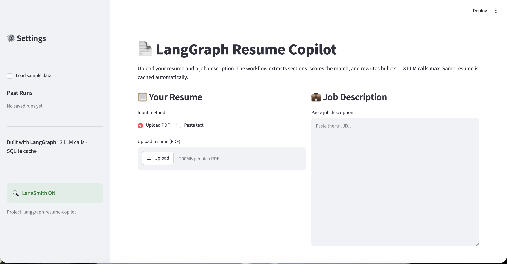
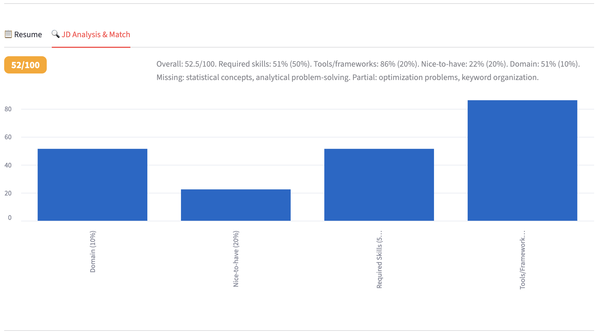
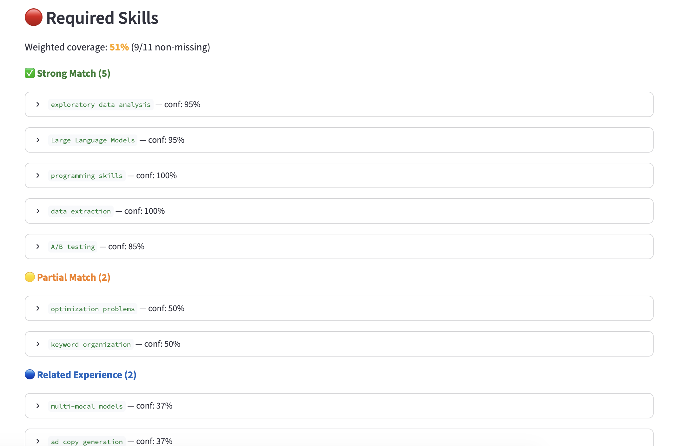
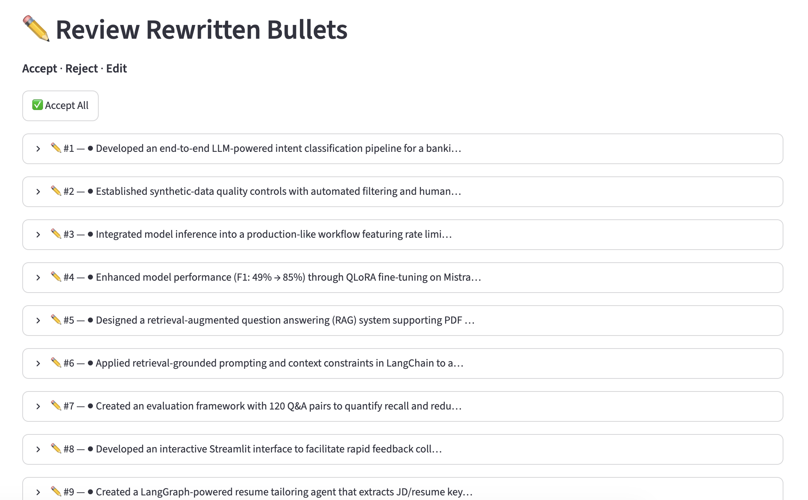

# LangGraph Resume Copilot

LangGraph Resume Copilot is an AI workflow system for resume–job description alignment, evidence-based keyword matching, deterministic scoring, and grounded resume rewriting.

The system extracts structured requirements from a job description, identifies resume evidence by section, computes a reproducible match score, rewrites bullet points with JD-aligned language, and supports human review before generating the final report.

---

## Engineering Highlights

* Multi-step LangGraph workflow with typed state, modular nodes, and conditional routing
* Structured LLM extraction using Pydantic schemas
* Deterministic scoring layer separated from LLM generation
* 4-level keyword matching system with alias-aware and related-experience matching
* SQLite-backed caching by resume and job description hash
* LangSmith tracing for node-level latency, token usage, and LLM call monitoring
* Unit-testable node design with mocked LLM calls

---

## Demo

### Resume and Job Description Input

Users can upload a resume as a PDF or paste resume text directly, then provide a job description for analysis.



### Match Score Overview

The system computes an overall resume–JD alignment score and breaks it down by weighted dimensions, including required skills, tools/frameworks, nice-to-have skills, and domain relevance.



### Keyword Match Breakdown

Extracted JD requirements are classified into four match levels: Strong Match, Partial Match, Related Experience, and Missing. Each item includes a confidence score and supporting resume evidence.



### Human-in-the-Loop Bullet Review

Rewritten bullets are reviewed before final report generation. Users can accept, reject, or edit suggested rewrites.



---

## Architecture

```text
input_validation          (pure Python)
    ↓
jd_keyword_extractor      (LLM #1 — cached by JD hash)
    ↓
resume_keyword_extractor  (LLM #2 — cached by resume hash)
    ↓
keyword_matcher           (pure Python — 4-level match engine)
    ↓
match_score               (pure Python — weighted scoring formula)
    ↓
bullet_rewriter           (LLM #3 — all bullets rewritten in one call)
    ↓
END
```

**6 nodes · 3 LLM calls max · SQLite cache**

The workflow separates LLM-based extraction and rewriting from deterministic scoring logic. This keeps the system more reproducible, easier to test, and less dependent on LLM-generated arithmetic or subjective scoring.

---

## Core Capabilities

### Resume and Job Description Parsing

* Section-aware resume extraction across Education, Experience, and Projects
* Structured JD requirement extraction for required skills, tools, nice-to-have skills, and domain signals
* PDF and plain-text resume input support

### Matching and Scoring

* 4-level match classification: Strong Match, Partial Match, Related Experience, and Missing
* Alias-aware keyword matching for AI/ML terminology
* Related-experience detection for adjacent concepts and transferable experience
* Deterministic weighted scoring implemented in Python

### Resume Rewriting

* Bulk bullet rewriting in a single LLM call
* JD-aligned language while preserving resume evidence
* Grounding checks to reduce unsupported or exaggerated rewrites
* Human review before final report generation

### System Reliability

* SQLite cache keyed by SHA-256 hashes of resumes and job descriptions
* Retry logic for structured output parsing
* LangSmith tracing for node-level latency, token usage, and LLM call monitoring
* Unit tests with mocked LLM calls, requiring no API key

---

## Workflow Design

The workflow is modeled as a typed LangGraph `StateGraph`, where each node owns one stage of the resume optimization pipeline.

| Component             | Implementation                                                           |
| --------------------- | ------------------------------------------------------------------------ |
| Typed state           | `GraphState` TypedDict flows through every node                          |
| Modular nodes         | Each node owns one responsibility and can be tested independently        |
| Conditional routing   | Missing inputs and extraction failures are handled through graph routing |
| Retry logic           | Failed structured output parsing retries up to 3 times                   |
| Deterministic scoring | Match scores are computed in Python, not generated by the LLM            |
| Human review          | Rewritten bullets are reviewed before final report generation            |

---

## Deterministic Match Scoring

Scoring is implemented in `src/scoring/match_score.py`.

To avoid hallucinated scores and inconsistent reasoning, all match scores are computed deterministically in Python. The LLM is only used for structured extraction and bullet rewriting, while scoring remains reproducible, inspectable, and testable.

| Dimension           | Weight |
| ------------------- | -----: |
| Required skills     |    50% |
| Tools / frameworks  |    20% |
| Nice-to-have skills |    20% |
| Domain relevance    |    10% |

### 4-Level Match System

| Level                 | Score | Criteria                                               |
| --------------------- | ----: | ------------------------------------------------------ |
| ✅ Strong Match        |   1.0 | All core tokens are present or an alias match is found |
| 🟡 Partial Match      |   0.6 | Some core tokens are present                           |
| 🔵 Related Experience |   0.4 | Adjacent or transferable experience is found           |
| ❌ Missing             |   0.0 | No supporting evidence is found                        |

### Alias Dictionary

The scoring engine includes an AI/ML-focused alias dictionary to reduce false negatives during keyword matching.

Examples:

* `vector database` → FAISS, Chroma, Pinecone, vector search
* `model monitoring` → evaluation framework, performance tracking
* `model deployment` → inference workflow, production pipeline
* `workflow orchestration` → LangGraph, StateGraph, Airflow
* `data quality` → quality filtering, data validation, human calibration
* `rag` → retrieval augmented generation, RAG pipeline, RAG system

---

## Performance Optimization: SQLite Caching

Resume and JD keyword extractions are cached by SHA-256 hash. This avoids repeated LLM calls when the same resume is evaluated against multiple job descriptions.

This design supports a realistic job-search workflow where one resume may be compared against many roles.

### Benchmark Results

Benchmark setup: **1 resume × 5 job descriptions × 3 runs = 15 total runs**

| Metric             | Cache OFF | Cache ON |
| ------------------ | --------: | -------: |
| Average latency    |     51.5s |    19.0s |
| Average LLM calls  |       3.0 |      1.0 |
| Latency reduction  |         — |      63% |
| LLM call reduction |         — |      67% |
| Cache hit rate     |         — |     100% |

---

## Normalization Layer

`src/utils/normaliser.py` provides an AI/ML domain normalization layer for more reliable keyword matching.

It includes:

* **80+ abbreviation expansions** — SFT, RLHF, DPO, QLoRA, PEFT, RAG, vLLM, FSDP
* **60+ synonym mappings** — fine-tuning variants, Hugging Face spellings, distributed training aliases
* **Phrase-level matching** — 2-word phrases require both core tokens; longer phrases require at least one meaningful token
* **Stopword filtering** — generic words such as `data`, `model`, and `system` do not trigger false matches alone

---

## Codebase Structure

```text
src/
├── graph/        # LangGraph state, nodes, routing, and workflow assembly
├── schemas/      # Pydantic structured output schemas
├── scoring/      # Deterministic keyword matching and weighted scoring
├── rewriting/    # Bullet grounding checks
├── storage/      # SQLite cache and run history
├── prompts/      # LLM prompts
└── utils/        # LLM provider, PDF parsing, config, tracing, and normalization
```

Key files:

```text
app.py                          # Streamlit UI
benchmark.py                    # Cache ON vs OFF benchmark
requirements.txt
.env.example

src/graph/state.py              # GraphState TypedDict
src/graph/nodes.py              # Workflow node functions
src/graph/workflow.py           # LangGraph assembly
src/graph/routing.py            # Conditional routing logic

src/scoring/match_score.py      # 4-level match engine and weighted scorer
src/utils/normaliser.py         # AI/ML keyword normalization layer
src/storage/db.py               # SQLite cache and run history
src/utils/llm.py                # Swappable LLM provider factory

tests/                          # Unit tests with mocked LLM calls
data/                           # Sample resumes and job descriptions
```

---

## Local Development

### 1. Clone and install

```bash
git clone https://github.com/EchoEvelyn/LangGraph_Resume_Copilot
cd LangGraph_Resume_Copilot

python -m venv .venv
source .venv/bin/activate

pip install -r requirements.txt
```

### 2. Configure environment

```bash
cp .env.example .env
```

Edit `.env`:

```bash
OPENAI_API_KEY=sk-...          # Required

LANGCHAIN_TRACING_V2=true      # Optional — LangSmith tracing
LANGCHAIN_API_KEY=ls__...      # Optional
LANGCHAIN_PROJECT=langgraph-resume-copilot
```

### 3. Run the app

```bash
python -m streamlit run app.py
```

### 4. Run tests

```bash
pytest tests/ -v
```

No API key is required for tests because all LLM calls are mocked.

### 5. Run benchmark

```bash
# Add your resume and 5 JDs to data/
# my_resume.txt, jd_1.txt ... jd_5.txt

python benchmark.py
```

---

## LLM Provider Configuration

The LLM provider can be changed through the `LLM_PROVIDER` environment variable.

```bash
LLM_PROVIDER=openai      # default
LLM_PROVIDER=anthropic   # requires langchain-anthropic
LLM_PROVIDER=together    # requires langchain-together
```

No graph node changes are required when switching providers.

---

## Testing

The test suite covers graph nodes, scoring logic, cache behavior, routing, parsing, and structured output handling.

```bash
pytest tests/ -v
```

Testing is designed to run without external API calls by using mocked LLM responses.

---

## Technology Stack

Python · LangGraph · LangChain · OpenAI API · Pydantic v2 · Streamlit · SQLite · LangSmith · pdfplumber · pytest

---

## Roadmap

Planned improvements include:

* Multi-version resume generation for different role families
* ATS formatting checks and keyword coverage reports
* More granular grounding checks for rewritten bullets
* Recruiter-style feedback on impact, clarity, and seniority alignment
* Exportable final reports in PDF or Markdown format
* Expanded evaluation set across AI Engineer, ML Engineer, Data Scientist, and Applied AI roles
